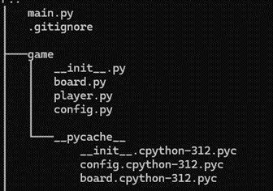
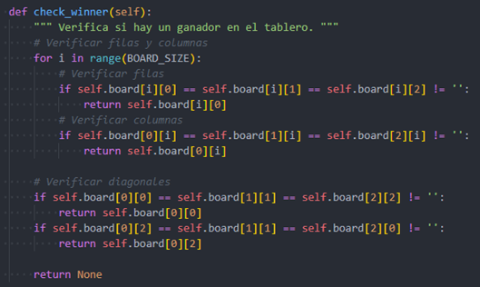
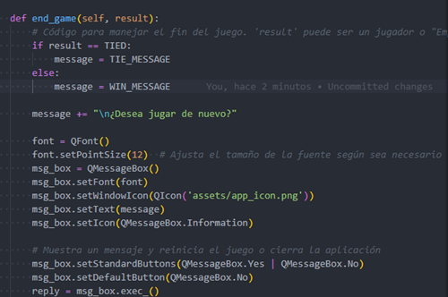

# Introduccion
El juego de Totito, también conocido como Gato, Tres en línea o Tic-tac-toe en inglés, es un clásico juego de estrategia para dos jugadores que se juega en un tablero de 3x3. A pesar de su simplicidad aparente, Totito ofrece una oportunidad para desarrollar habilidades de pensamiento estratégico y táctico.
La historia de Totito se remonta a la antigüedad, con evidencia de variantes de este juego que datan de hace siglos. Aunque las reglas básicas son simples, el juego proporciona un desafío que atrae tanto a niños como a adultos.
Con solo un tablero y unos pocos símbolos, Totito es fácil de aprender y jugar, pero puede volverse emocionante a medida que los jugadores compiten por ser los primeros en alinear tres de sus símbolos en línea, ya sea horizontal, vertical o diagonalmente. Cada movimiento implica una decisión estratégica, ya sea para bloquear al oponente, crear oportunidades para formar líneas propias o mantener el control del tablero.

# Historia

La historia del totito se remonta a principios del siglo XX en Argentina y Uruguay, donde se originó como una forma de entretenimiento popular en reuniones sociales y eventos familiares. Se cree que el juego evolucionó a partir de prácticas similares que se remontan incluso más atrás en el tiempo.

# Reglas del juego:

**Preparación:** Coloca el tablero de Totito sobre una superficie plana y asegúrate de que esté vacío al principio del juego.
**Elección de símbolos:** Los jugadores deben decidir quién usará las fichas "X" y quién usará las fichas "O". Esto se puede determinar al azar o por acuerdo mutuo.
**Turnos:** Los jugadores se turnan para colocar una ficha en el tablero. El jugador que usa las fichas "X" va primero, seguido por el jugador que usa las fichas "O". Los jugadores continúan alternando turnos hasta que se complete el juego.
**Objetivo:** El objetivo del juego es colocar tres fichas del mismo tipo en línea, ya sea horizontal, vertical o diagonalmente.
**Ganador:** Si un jugador logra colocar tres de sus fichas en línea, ese jugador gana la partida. Si el tablero se llena antes de que un jugador pueda lograr una línea de tres, se considera un empate.
**Finalización:** Una vez que se completa el juego, ya sea porque un jugador ha ganado o porque se ha producido un empate, se puede iniciar una nueva partida si los jugadores desean continuar.

El juego del Totito "X" y "O" es una variante interesante del juego clásico de Tic-Tac-Toe, ya que agrega un elemento estratégico adicional al tener que decidir dónde colocar las fichas en un tablero más grande. ¡Diviértete jugando!

# Estrategias:

Los jugadores suelen tratar de bloquear a su oponente y al mismo tiempo intentar formar su propia línea.
Hay algunas estrategias básicas para garantizar que no se pierda la oportunidad de ganar si el oponente comete un error.
Debido a la naturaleza simétrica del tablero, el juego puede resultar en empate si ambos jugadores juegan de manera óptima.

# Especificaciones del Código

**Carpeta Game:** Dentro de esta carpeta se encuentran todos los archivos .py que contienen la lógica del juego, así como las configuraciones para determinar al ganador como en el caso de un empate y si el usuario desea jugar nuevamente.

**Carpeta UI:** Dentro de este apartado podremos encontrar todos los archivos que contiene todo el apartado visual del programa, de modo que para el usuario le sea más sencillo entender cómo funciona el juago y este pueda jugarlo cuantas veces quiera.

# Lógica del Juego

**Check Winner:**
Dentro de la programación del juego dicha validación procura realizar una búsqueda dentro de las filas, columnas y diagonales, haciendo un recorrido por cada una de las mismas así también como sus diagonales, revisando los caracteres para poder verificar al ganador, dependiendo del caso que devuelvan, este mostrará el ganador de la partida. Si en algún caso es verdadero este ejecutara la función de terminar juego

**End Game:**
Esta función configura la ventana que muestra el resultado y al símbolo ganador.

# Conclusión
Un totito es un algoritmo de inteligencia artificial simple en donde realiza una búsqueda exhaustiva de todas las posibilidades de algoritmos de aprendizajes automático  en donde mejoran el rendimiento a medida que se juegan más partidas.
Se pueden utilizar técnicas de aprendizaje automático para entrenar modelos que jueguen al totito. Estos modelos pueden aprender de ejemplos de partidas anteriores y ajustar sus estrategias en consecuencia. El totito es un juego que implica estrategia y planificación a corto y largo plazo. Por lo tanto, jugar al totito puede servir como un campo de prueba para algoritmos de inteligencia artificial diseñados para juegos estratégicos más complejos, como el ajedrez.

La inteligencia artificial se relaciona con el juego de totito de varias maneras, desde el desarrollo de algoritmos de búsqueda y aprendizaje automático para jugar el juego de manera autónoma, hasta la mejora de la experiencia de juego para los humanos. Este juego simple proporciona un terreno fértil para la investigación y el desarrollo en el campo de la inteligencia artificial, y sirve como un punto de partida para explorar conceptos más avanzados en juegos estratégicos y sistemas inteligentes.